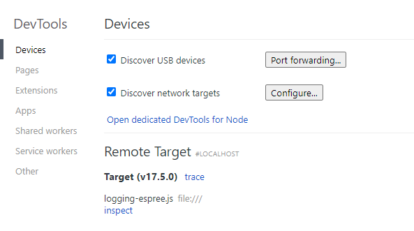
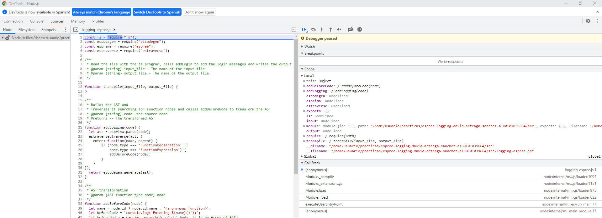

# [Práctica Espree Logging]

### Procesadores de lenguajes 2022-2023

#### David Arteaga Sánchez  alu0101039664 

## Informe

### Debugger

Para realizar esta práctica debemos de ejecutar el código contenido en el fichero `logging-espree.js` con el debugger de chrome, para ver paso a paso su ejecución. Para ello nos dirigiremos al directorio `/src` y ejecutaremos el comando 
```console
node --inspect-brk logging-espree.js
``` 

Una vez hecho esto abriremos el navegador Google Chrome y en la barra de búsqueda introduciremos [chrome://inspect](chrome://inspect). Al entrar veremos algo como:



Como podemos ver en la parte inferior de la imagen, nos reconoce el debugger con el fichero loggin-espree.js en espera. Haremos click donde pone **Open dedicated DevTools for Node**. Veremos algo así:



### Entendiendo el código

Una vez dentro del debugger seremos capaces de ejecutar paso por paso el código que nos concierne, viendo en el proceso el valor de las estructuras de datos que componen el programa. Hagámoslo para entender mejor el código, en concreto la función `addLogging(input)`.

#### esprima.parse()

Podemos ver como primero se llama a la función `esprima.parse()` y le pasamos el código de entrada como argumento. Usando el debugger vemos cómo esta función se encarga de parsear el código que recibe como entrada y generar un árbol ast que en este caso estamos almacenando en la variable `let ast`. En la parte derecha del debugger accedemos a las estructuras de datos y si entramos en `ast` podemos ver nodo por nodo cómo está compuesto el árbol.

#### estraverse.traverse()

Una vez creado el ast se lo pasamos como argumento a la función estraverse.traverse(). Esta recorre el árbol nodo por nodo. En el código es usado para leer el árbol por completo y cada vez que se entre en un nodo comprobar si se trata de un nodo que represente una función (*FunctionDeclaration* o *FunctionExpression*) y si es así llama a la función `addBeforeCode()` pasándole el nodo como argumento.

#### addBeforeCode()

Esta función es usada en el código para añadir la línea de código `console.log('Entering ${name}()');` justo después de la declaración de la función, antes de entrar al `BlockStatement`. Esto lo consigue parseando la línea de código descrita anteriormente (generando así un ast) y concatenándole el nodo nieto (hijo del hijo) del nodo que le pasamos en un primer momento a la función. Sustituiremos el subarbol que contiene el nodo nieto por este nuevo ast que hemos conseguido con la concatenación y habremos conseguido insertar una línea de código en el árbol ast.

#### escodegen.generate()

Finalmente convertiremos el árbol ast de nuevo a código javascript con la función `escodegen.generate()`. Podemos apreciar como se han añadido las líneas de código que hemos comentado con los console.log al código final.

[Chrome Debugger return value](img/chrome_debugger_console_log.png)

## El ejecutable

```
✗ bin/logging.js -h
Usage: jslogging [options] <filename>

Adds logs to javascript code

Arguments:
  filename                 file with the original code

Options:
  -V, --version            output the version number
  -o, --output <filename>  file in which to write the output (default: "output.js")
  -h, --help               display help for command
```

```
git:(main) ✗ cat test/test1.js 
function foo(a, b) {   
    var x = 'blah';   
    var y = (function () {
      return 3;
    })();
  }     
foo(1, 'wut', 3);
➜  git:(template) ✗ bin/logging.js test/test1.js -o salida.js
File read succesfully
Output written succesfully in salida.js
➜  git:(template) ✗ node salida.js
Entering foo(1, wut) at line 1
Entering <anonymous function>() at line 3
```

## CLI con [Commander.js](https://www.npmjs.com/package/commander)

Usando el paquete Commander de npm podemos parsear los comandos introducidos por consola. Esto lo usaremos para poder pasar como argumento el nombre del fichero de entrada y el de salida. Una posible forma de realizarlo sería así:

```javascript
const {program} = require('commander');
const {version, description} = require('../package.json');
const { transpile } = require('../src/logging-espree.js')
program
    .name("jslogging")
    .version(version)
    .description(description)
    .argument("<filename>", 'file with the original code')
    .option("-o, --output <filename>", "file in which to write the output", "")
    .action((filename, options) => {
       transpile(filename, options.output);
    });

program.parse(process.argv);
```

Ahora podremos imprimir un breve resumen del funcionamiento del programa con el flag `--help`, la versión del programa con `-V` y añadir la opción de volcar la salida en un fichero externo con `-o <filename>`

## Reto 1: Soportar funciones flecha

Una de las modificaciones propuestas es conseguir que espree parsee también funciones flecha. Para ello deberemos indicar una version de ecma que las soporte.

```javascript
let ast = esprima.parse(code, {ecmaVersion:12});
```

Una vez indicada deberemos añadir la opción a la hora de analizar los nodos para que también compruebe si se declara una función flecha:

```javascript
if (node.type === 'FunctionDeclaration' ||
            node.type === 'FunctionExpression' || 
            node.type === 'ArrowFunctionExpression') {
            addBeforeCode(node);
        }
```

## Reto 2: Añadir el número de línea

Otra de las modificaciones que se proponen es añadir el número de línea en el que se encuentran los `console.log()`. Para ello deberemos añadir el flag `loc: true` a la hora de llamar al parser de *espree*.

```javascript
let ast = esprima.parse(code, {ecmaVersion:12, loc: true});
```

Ahora lo extraeremos del atributo `loc.start.line` de node
```javascript
let beforeCode = `console.log(\`Entering ${name}(${parameters}) at line ${node.loc.start.line}\`);`;
```

## Tests

Podemos ejecutar los test del directorio `./test` con el objetivo de comprobar la salida de nuestro programa. Para automatizar este proceso lo incorporaremos como script en el fichero `package.json` para poder ejecutarlos con `npm`. Añadimos entonces:

```json
"scripts": { 
  "test": "./bin/all-test.sh",
  "start": "./jslogging ./test/test1.js"
}
```

## Coverage

Para ejecutar las pruebas de cobertura de código añadiremos al `package.json` un nuevo script: 

```json
"cov": "nyc npm test"
```

Si lo ejectuamos recibiremos algo como:

```
----------|---------|----------|---------|---------|-------------------
File      | % Stmts | % Branch | % Funcs | % Lines | Uncovered Line #s 
----------|---------|----------|---------|---------|-------------------
All files |       0 |        0 |       0 |       0 |                   
----------|---------|----------|---------|---------|-------------------
```

## Publicación como paquete npm

Para publicar el paquete como npm con ámbito @aluXXX primero nos crearemos una cuenta en npmjs. Una vez hecho esto iremos al `package.json` y el nombre lo modificaremos para añadirle el ámbito. Quedaría algo así:

```json
"name": "@alu0101039664/espree-logging-solution",
```

Finalmente ejecutamos `npm publish` y nuestro paquete estará publicado.

## Integración Continua

Para añadir integración continua a nuestro repositorio haremos uso de las Github Actions. Para ello crearemos el directorio `.github/workflows` y añadiremos un fichero .yml con este contenido:

```yml
# Write your workflow for CI here
name: CI

# Controls when the workflow will run
on:
  # Triggers the workflow on push or pull request events but only for the $default-branch branch
  push:
    branches: [ main ]
  pull_request:
    branches: [ main ]

  # Allows you to run this workflow manually from the Actions tab
  workflow_dispatch:

# A workflow run is made up of one or more jobs that can run sequentially or in parallel
jobs:
  # This workflow contains a single job called "build"
  build:
    # The type of runner that the job will run on
    runs-on: ${{ matrix.os }}
    strategy:
      matrix: 
        os:
          - ubuntu-latest
        node_version: [19.x]
        architecture:
          - x64

    name: Node ${{ matrix.node_version }} - ${{ matrix.architecture }} on ${{ matrix.os }}
    # Steps represent a sequence of tasks that will be executed as part of the job
    steps:
      # Checks-out your repository under $GITHUB_WORKSPACE, so your job can access it
      - uses: actions/checkout@v2
      - name: Setup node
        uses: actions/setup-node@v2
        with:
          node-version: ${{ matrix.node_version }}
          architecture: ${{ matrix.architecture }}
      - run: npm install
      - run: npm test
```